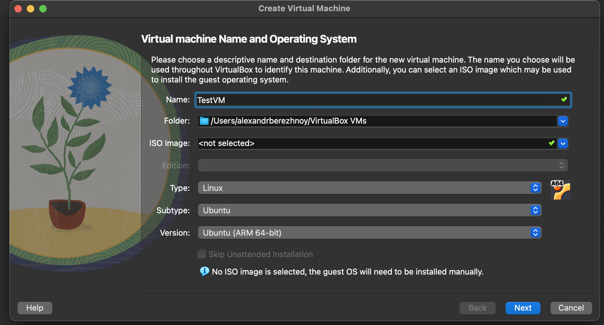
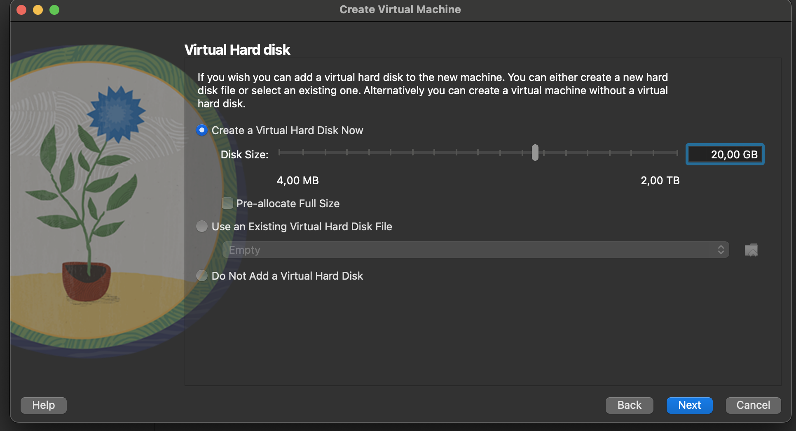
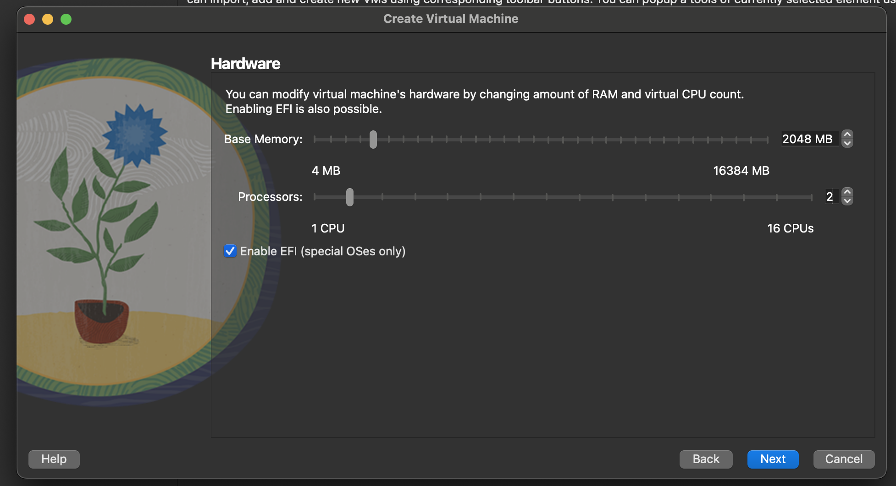
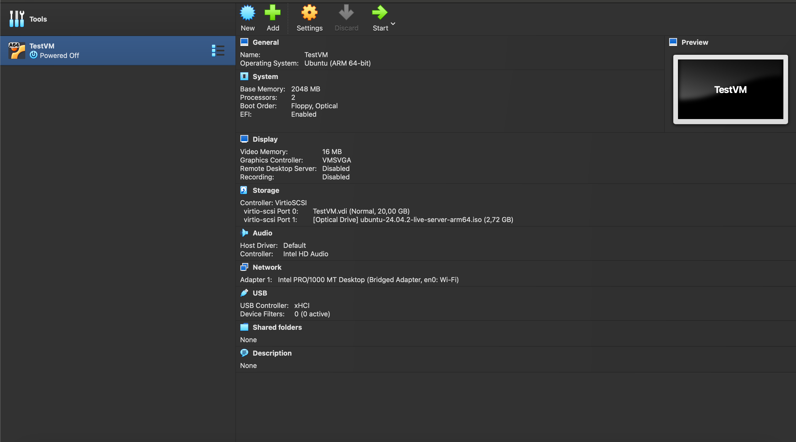
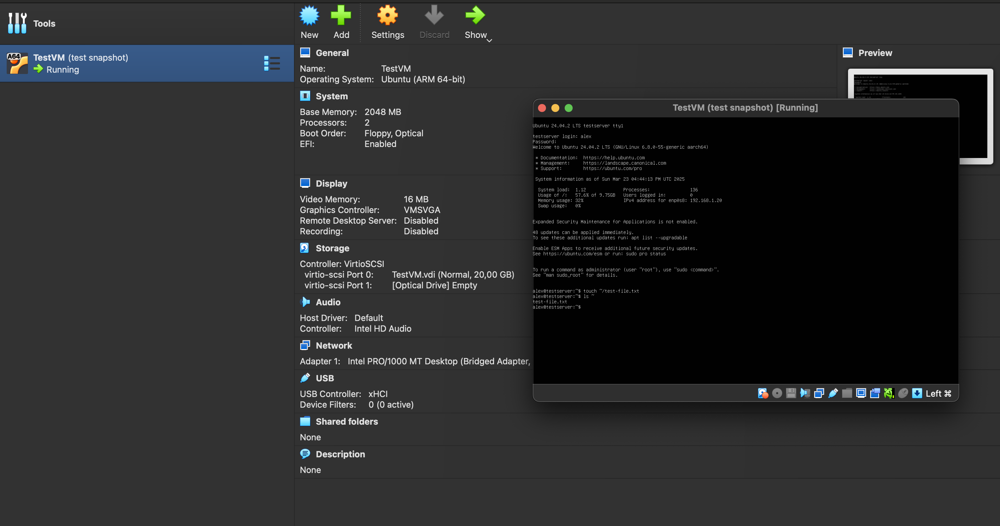
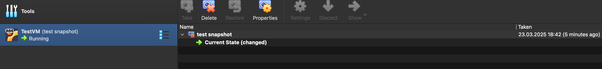
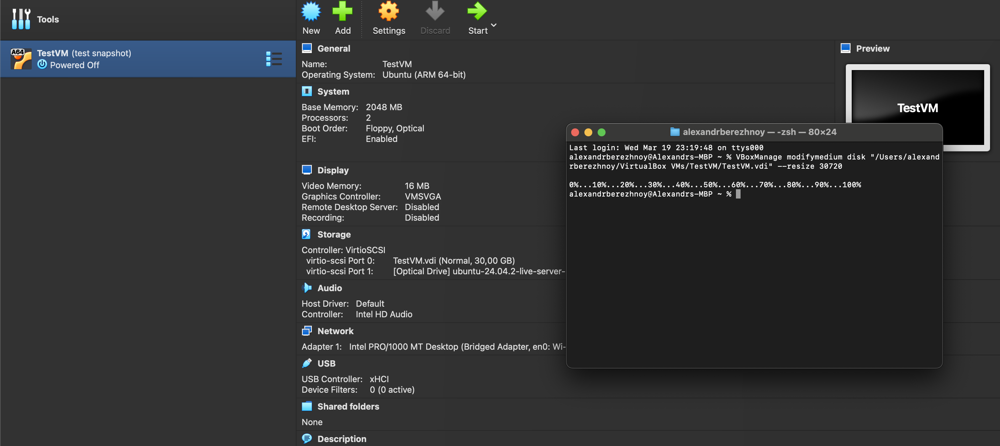
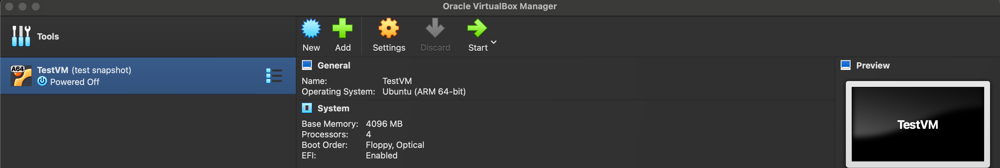

# devops-course

# Lecture 3

## 1. Creating a New Virtual Machine

- Name: `TestVM`
- Type: Linux
- Version: Ubuntu 64-bit (ARM)
- RAM: 2 GB
- HDD: 20 GB (VDI format)

## 2. VM Configuration

- EFI enabled
- Network: Bridged Adapter
- CPU: 2 cores

## 3. Ubuntu Installation

- Used Ubuntu 24.04 LTS ARM64 ISO (server edition)
- Installed without a GUI
- Created a default user account

## 4. Snapshots & Restore Test

- Created a snapshot after installation.
- Created a test file: `test-file.txt`.
- Restored the VM to the snapshot — file disappeared as expected.

## 5. VM Parameter Changes

### Resizing the Disk

- Resized the VDI file from 20 GB to 30 GB using the command:
  VBoxManage modifymedium disk "<path>/TestVM.vdi" --resize 30720

### Increasing CPU & RAM

- Increased CPU to 4
- Increased RAM to 4 GB

